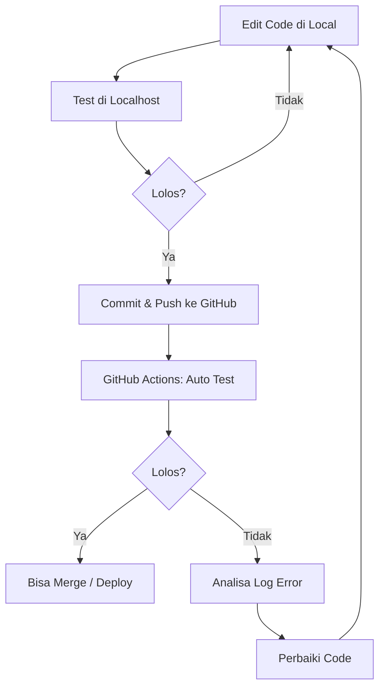

# AGENT.md — Panduan untuk Semua Model AI

Dokumen ini adalah satu-satunya sumber kebenaran bagi AI yang bekerja pada proyek **InventoriKu v2.0**. Semua perubahan, analisis, dan keputusan harus mematuhi aturan berikut.

---

## 1. PRINSIP DASAR (dari AGENT.py)

| Prinsip | Deskripsi |
|---------|-----------|
| **Input Validation** | Semua input pengguna harus divalidasi. Blokir PII/credentials (email, password, token, API key, SSN, kartu kredit, telepon) sebelum diproses. |
| **Tool Whitelisting** | Hanya tool/endpoint yang terdaftar yang boleh diakses. Tidak ada akses ke fungsi yang tidak dikenal. |
| **Audit Trail** | Setiap operasi harus tercatat (siapa, apa, kapan, hasilnya). Log yang lengkap untuk kepatuhan. |
| **Error Handling** | Semua error harus ditangani dengan retry mechanism dan pesan yang jelas. Jangan expose stack trace ke user. |
| **Output Sanitization** | Hapus/redact PII dari output sebelum dikirim ke user. |
| **Honest Simplicity** | Sederhana, jujur, dan deterministik lebih baik daripada kompleks dan tidak bisa diandalkan. |

---

## 2. WORKFLOW PENGEMBANGAN (CI/CD)

Setiap perubahan WAJIB mengikuti alur ini:



### Aturan Detail:

1. **Sebelum coding**: Baca file terkait dan pahami konteksnya.
2. **Setelah edit**: Jalankan test lokal.
   - Backend: `cd backend && php artisan test`
   - Frontend: `cd frontend && npm run lint`
3. **Jika test lokal lolos**: Commit dan push ke GitHub.
   ```
   git add .
   git commit -m "deskripsi perubahan"
   git push
   ```
4. **GitHub Actions** akan otomatis menjalankan test. Periksa hasilnya di tab Actions repository.
5. **Jika test Gagal di GitHub**:
   - Analisa log error dari GitHub Actions
   - Identifikasi penyebab kegagalan
   - Perbaiki code di local
   - Ulangi dari langkah 2

---

## 3. ARSITEKTUR APLIKASI

### 3.1 Tech Stack

| Layer | Teknologi |
|-------|-----------|
| **Backend** | Laravel 11 + PHP 8.x |
| **Frontend** | React 19 + Vite 8 + Tailwind CSS 4 |
| **Database** | SQLite (default) / MySQL |
| **Auth** | Laravel Sanctum (token-based) |
| **State** | React Context + localStorage |
| **HTTP** | Axios |
| **Charts** | Recharts |
| **Icons** | Lucide React |
| **Modals** | SweetAlert2 |

### 3.2 Database Schema

| Tabel | Kolom Utama |
|-------|-------------|
| `users` | id, name, email, password, role (manager\|cashier), theme |
| `items` | id, name, selling_price, description, deleted_at (soft delete) |
| `inventories` | id, item_id, stock, average_purchase_price |
| `sales` | id, item_id, quantity, selling_price, purchase_price, sale_date, transaction_id, payment_method (cash\|qris), cash_paid |
| `restocks` | id, item_id, quantity, purchase_price, restock_date |

### 3.3 API Endpoints

| Method | Endpoint | Akses |
|--------|----------|-------|
| POST | `/api/login` | Public |
| POST | `/api/register` | Public |
| GET | `/api/me` | Any auth |
| POST | `/api/logout` | Any auth |
| POST | `/api/update-theme` | Any auth |
| GET | `/api/dashboard` | Manager only |
| CRUD | `/api/items` | Manager only |
| CRUD | `/api/users` | Manager only |
| R | `/api/restocks` | Manager only |
| C | `/api/restocks` | Manager only |
| R | `/api/sales` | Any auth |
| C | `/api/sales` | Any auth |
| GET | `/api/sales/summary` | Any auth |
| GET | `/api/sales/transactions` | Any auth |

### 3.4 Role Access

| Fitur | Manager | Kasir |
|-------|---------|-------|
| Dashboard | ✅ | ❌ |
| Jenis Barang (CRUD) | ✅ | ❌ |
| Restock Gudang | ✅ | ❌ |
| Kasir / POS | ❌ | ✅ |
| Riwayat Penjualan | ✅ | ✅ |
| Ganti Tema | ✅ | ✅ |
| Daftar Akun (CRUD) | ✅ | ❌ |

---

## 4. ANALISIS KESELARASAN (ALIGNMENT CHECK)

### 4.1 Issues yang Ditemukan

| Issue | Detail | Severity | Status |
|-------|--------|----------|--------|
| **Backend Role Middleware Tidak Ada** | Tidak ada middleware/policy yang membatasi akses ke endpoint manager. Cashier bisa akses `/api/items`, `/api/dashboard`, `/api/restocks` jika tahu URL-nya. | **HIGH** | 🔴 Perlu diperbaiki |
| **ROLE_ACCESS_GUIDE.md Outdated** | Dokumentasi menyatakan Kasir tidak bisa akses Riwayat Penjualan, tapi kode sudah mengizinkannya (fitur v2.0) | **LOW** | 🟡 Perlu diupdate |
| **InventoryController Kosong** | Controller ada tapi tidak digunakan di routes. Dead code. | **LOW** | 🟡 Perlu dibersihkan |
| **Frontend Role Routing** | Proteksi role hanya di frontend (conditional rendering). Tanpa backend middleware, ini tidak aman. | **MEDIUM** | 🟡 Perlu backend middleware |
| **SalesController Role Check Hilang** | Semua user auth bisa akses semua sales endpoints, tidak ada pembedaan manager/kasir. | **LOW** | 🟢 OK untuk desain saat ini |

### 4.2 Menambahkan Role Middleware (Rekomendasi)

Buat middleware `CheckRole` dan terapkan di route groups:

```php
// app/Http/Middleware/CheckRole.php
public function handle(Request $request, Closure $next, ...$roles)
{
    if (!in_array($request->user()->role, $roles)) {
        return response()->json(['message' => 'Unauthorized.'], 403);
    }
    return $next($request);
}
```

```php
// routes/api.php
Route::middleware(['auth:sanctum', 'role:manager'])->group(function () {
    Route::apiResource('items', ItemController::class);
    Route::apiResource('users', UserController::class);
    Route::get('/dashboard', [DashboardController::class, 'index']);
    Route::apiResource('restocks', RestockController::class)->only(['index', 'store']);
});
```

---

## 5. CODING CONVENTIONS

### Backend (Laravel)
- Gunakan **DB transactions** untuk operasi multi-tabel (Item + Inventory, Sale + Inventory, Restock + Inventory)
- Gunakan **SoftDeletes** untuk items (jangan hapus permanen)
- Gunakan **Form Request** atau inline validation
- Gunakan **API Resources** untuk transformasi response (opsional)
- Role check harus di **backend middleware**, bukan hanya di frontend

### Frontend (React)
- Gunakan **functional components** dengan hooks (useState, useEffect, useCallback)
- State management via **localStorage + Context** (bukan Redux/Pinia)
- API calls via Axios instance (`api.js`) yang handle token otomatis
- Routing via **react-router-dom v7**
- Styling via **Tailwind CSS + CSS variables** (theme system)
- Theme classes dari `themes.js` via `getThemeClasses()`

### Database
- Migrations harus **reversible** (up() dan down())
- Gunakan **foreign key constraints**
- Gunakan **transactions** untuk data consistency

### Git
- Commit message dalam **Bahasa Indonesia** atau **English**
- Satu commit = satu perubahan logis
- Jangan commit file dari `node_modules/`, `vendor/`, `.env`
- Jangan commit credentials atau secrets

---

## 6. DOKUMENTASI

File dokumentasi yang WAJIB dijaga sinkronisasinya:

| File | Isi |
|------|-----|
| `README.md` | Gambaran umum, quick start, akun default |
| `AGENT.md` | Rules untuk AI (file ini) |
| `RINGKASAN_LENGKAP_SEMUA_FITUR.md` | Daftar fitur lengkap |
| `ROLE_ACCESS_GUIDE.md` | Panduan RBAC (perlu diupdate) |
| `MANUAL_BOOK_INVENTORIKU.md` | Manual book lengkap |
| `CHANGELOG_V2.md` | Catatan perubahan versi |

Jika ada perubahan fitur, UPDATE dokumentasi yang relevan di commit yang SAMA.

---

## 7. TESTING

- Backend: `php artisan test` (PHPUnit)
- Frontend: `npm run lint` (ESLint)
- Sebelum commit: Pastikan test lokal lolos
- Setelah push: Cek GitHub Actions
- Jika test gagal: JANGAN commit fix tanpa test ulang

---

*Ditetapkan: 22 Juni 2026*
